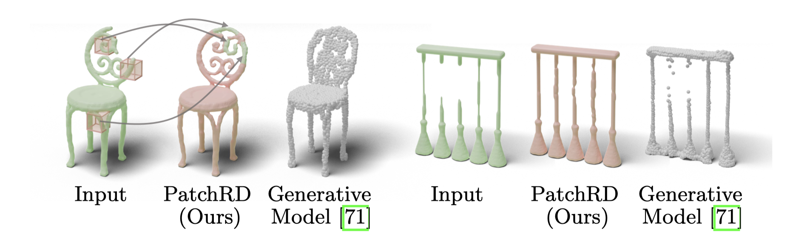

# PatchRD
Code for ECCV 2022 paper PatchRD: Detail-Preserving Shape Completion by Learning Patch Retrieval and Deformation. (PDF will be released soon!)
<p align="center"> 

</p>

## Installation
Install [Pytorch](https://pytorch.org/get-started/locally/). It is required that you have access to GPUs. The code is tested with Ubuntu 18.04, Pytorch v1.9.0 and CUDA 10.2.

Install [ChamferDistancePytorch](https://github.com/ThibaultGROUEIX/ChamferDistancePytorch) by following the instructions in their github repo. 

Install [psbody](https://github.com/MPI-IS/mesh) for mesh reading and writing. 

Install the following Python dependencies (with `pip install`):

    numpy
    scipy
    h5py
    sklearn
    skimage
    opencv-python
    kornia
    pytorch=1.9.0

## Data Download
You can download the dataset [here](https://www.dropbox.com/s/phiw7kjw7d1dfu4/data.zip?dl=0). It's a voxelized dataset for 8 classes in ShapeNet. Train/Test spliting is in `./splits`.  
To evaluate the chamfer distance, we convert our output to point cloud and use the point cloud with 16384 points from [Completion3D](https://completion3d.stanford.edu/) dataset as the ground truth. You can either download it from the offcial website or directly [here](https://www.dropbox.com/s/e1g071m10xm7zug/completion3d.zip?dl=0).  

## Training 
There are four steps to train our framework. 
The default settings train model for the chair category. You can change the arguments `--data_content` and `--data_dir` in each bash script to train on other categories. 

### Step 1: Coarse Completion 
This stage takes a partial shape as input, and output the coarse full shape (4x downsampled shape of the detailed full shape). 
```
./complete_train.sh
```

### Step 2: Retrieval Learning 
First train the patch encoder to learn the feature embeddings for the coarse and detailed patch pair. 
```
./patch_train.sh
```
Then dump the intermediate retrieval results to train the deformation. **You have to add `--dump_deform` in `patch_train.sh`**, then run 

```
./patch_train.sh
```

### Step 3: Initial Deformation Learning 
This step learns the initial deformation for the jointly learning stage. Run

```
./deform_train.sh
```
Then dump the intermediate initial deformation results to train the deformation and blending stage. **You have to add `--dump_deform` in `deform_train.sh`**, then run 

```
./deform_train.sh
```

### Step 4: Deformation and Blending 
This step joinly learn the deformation and blending. Run 
```
./joint_train.sh 
```

## Evaluation 
After training all four networks, you can run the following scripts to run the completion results from a randomly cropped shape. You can find the input and output mesh in `./samples_joint`. 
```
test_joint.sh
```


## Citation 
If you find our work useful in your research, please consider citing:

    @inproceedings{sun2022patchrd,
        author = {Bo, Sun and Kim, Vladimir(Vova) and Huang, Qixing and Aigerman, Noam and Chaudhuri, Siddhartha},
        title = {PatchRD: Detail-Preserving Shape Completion by Learning Patch Retrieval and Deformation},
        booktitle = {Proceedings of the IEEE European Conference on Computer Vision},
        year = {2022}
    }
